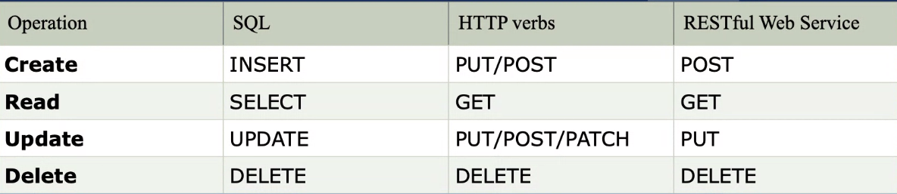

Dia 25
-
- Repaso general de lo que llevamos y vimos ayer, me he conectado casi a las 9.20 me he perdido un poco el principio
- Hemos visto un interfaz de spring que se llama converter que es para transformar datos simples en objetos, en nuestro caso hemos convertido datos String en un objeto ingrediente
- Hacemos el repo de la entidad Taco y seguramente haremos el repo de la entidad Order
- Efectivamente ahora vamos con el repo y el impl repo de Order, seguimos con jdbc, para este repo estamos usando simplejdbcinsert y no el jdbctemplate de siempre
- Ahora vamos a ver a lanzar errores personalizados, hemos creado un html simple para mostrar los mensajes y un ErrorController que llame a ese html
- De ultima ha habido más historias y esta hablando sobre la importancia de los "microservicios", lo más probable comenta que será que acabemos trabajando haciendo microservicios y que de hecho es como tiene a su juniors en su pryecto, haciendo microservicios con java y spring.
- Estos ultimos 20 min vamos a empezar a migrar la app a JPA, primero cambiar los modelos a entidades, lo de poner @entity y tal tal
- Agregamos dependencia jpa en el pom
- Cambiamos los modelos a entidades
- Para eso, poner el entity y poner un @Id a nuestra PK ademas de otras etiquetas como getter setter allconstructor etc
- @Enumerated(EnumType.STRING) --> Esto es para montar enums
- No dio tiempo de ver mas, porque al parecer hemos visto con Carlos JPA con Spring y con Mario vamos a ver JPA con Spring Boot y tienes ciertas diferencias

DIA 26
-
- Quien no mira a los ojos no es de fiar, mirad a los ojos en las entrevistas
- Podemos tener varias entrevistas (lo de mi piruleta)
- Tipos de entrevistas y entrevistadores, bajar o no la guardia
- La de, no he encontrado trabajo porque no tendría totalmente las habilidades necesarias pero las he conseguido y estoy preparado para este puesto
- Importante hacer preguntas sobre condiciones, contrato, dinero, equipo.
- Tendremos una reunion on Irene que estará con nosotros mentorizando la busqueda de empleo despues del curso

DIA 27
-
- Vamos a terminar la app de tacos añadiendole JPA
- @ManyToMany(targetEntity = Ingredient.class) Otra forma de hacer lo del mapped by y enlazar tablas manytomany
- @PrePersist Esto hace que los metodos que pongamos con esto pasen directamente a persistencia(a guardarse en la base de datos), lo hemos usado con la fecha para registrar la fecha justo en el momento de creacion del taco
- Hemos adaptado finalmente el proyecto a jpa, basicamente metiendo entidades y cambiando los repos para que extiendan en este caso de crudrepository y no jparepository pero al final jparepo extiende a su vez de crudrepo
- Ahora vamos a ver las API Rest.
- 
- Estos serian los principales verbos/etiquetas usadas en una API REST
- Ahora vamos a montar una API REST
- Hemos visto el concepto de ResponseEntity
- Estamos probando errores usando clases del ResponseEntity
- Hemos hecho todo el crud de taco pero usando ResponseEntity y un RestController y no Controller que es el proceso para hacer API REST
- Es decir hacer los metodos de la foto de arriba
